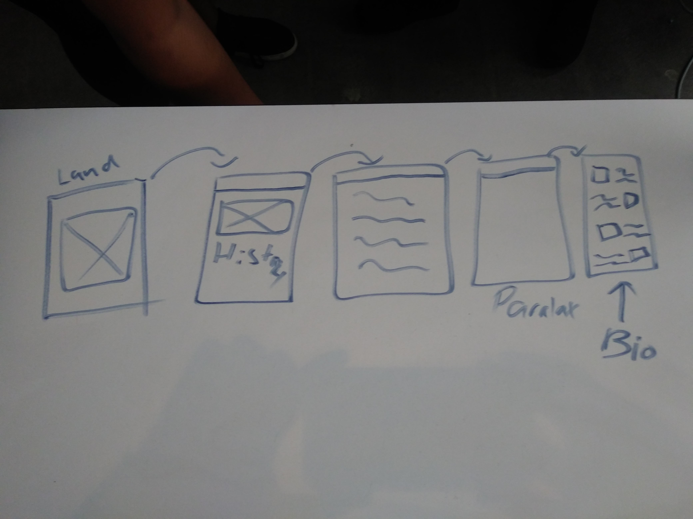

# My First Website

#### A site built from top to bottom as my first website project.

## Description
The "Joos" podcast site is my first attempt to create a multi-page website. The hosts, segments, and content of this site are all original ideas. The goal was to show createive ways to display content while making a webpages that are interactive and engaging.

## Table of Contents
* [Technologies Used](#technologiesused)
* [Features](#features)
* [Design](#design)
* [Project Next Steps](#nextsteps)
* [Deployed App](#deployment)
* [About the Author](#author)

## Technologies Used
* JavaScript
* HTML5
* CSS3
* jQuery

## Features
* Users can read interactive descriptions of podcast hosts
* Users can get insight into content provided by podcast creators
* Users can listen to podcast episodes
* Users can purchase games of interest advertised by hosts
* Users can see up to date news on all things gaming
* Users will be able to access shop items and purchase at later  date
* Users can view hosts highlighted clips
* Users can see targeted ad content placed by hosts
* Users can view live gaming stream from twitch

## Whiteboard Images
*Original Whiteboard sketch

## Trello Planning
* All planning in notebooks

## Design
* Design elements implemented using HTML5 and CSS3. 

## Project Next Steps
* Visitors will be able to shop for content related items
* Users can change the theme.

## Deployed Link
[Netlify](https://thejoospod.netlify.app/)

* You can view the repository:
[Github.com](https://github.com/Gr8ness21/joosPodcast)
* If unable to view please go live locally through VS Code
    
## Works Cited:
* N/A

## About The Author
I build applications and mini projects tied to my various interests. I look for creative solutions to real world problems and think of technical ways to address them. While no application is ever perfect I find joy in the process and all my final products!
